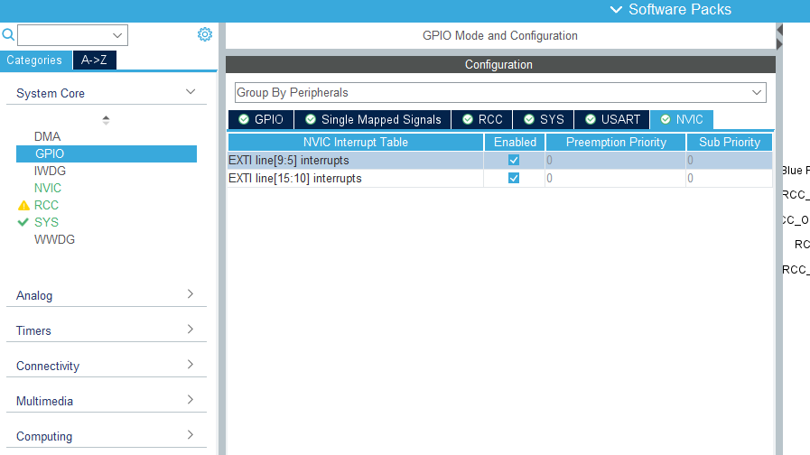
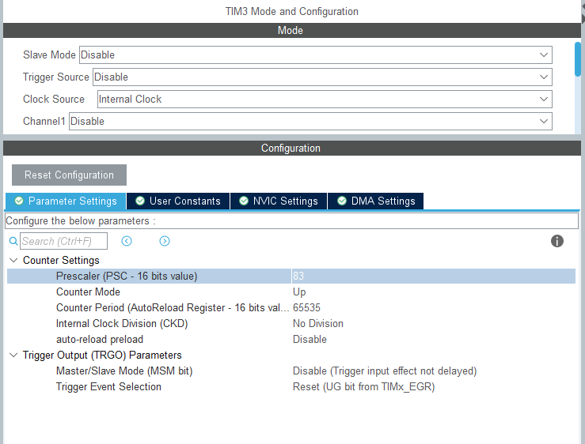

# 4일차
## Inturrupt
장치들의 버퍼가 가득차면 인터럽트라는걸 발생시켜 램에 데이터를 적재

- IRQ Pin
- Interrupt number
- Interrupt service routine
- Interrupt vector
- Interrupt vector line
- Interrupt ?

## NVIC M arch

### Interrupt and exception vetors

-3 fixed reset
-2 fixed NMI
-1 fixed hardfault
0 ~ settable

EXTI external interrupt Register

- software interrupt - or - hardware interrupt
- interrupt mask - and gate
- NVIC interrupt controller

EXTI IMR
00 : masked (not allow)
01

 : not masked (allow)

EXTI[3:0]
0010 PC


### INTC
irp req
-> 폴링?

### CPU에게 인터럽트를 전달하는 DMA 장치
### DMA Controller
채널이 여러개있음
irq req -> dmareq

3가지 방식
폴링 기법 - 주기적으로 상태를 살핌
인터럽트 - 

---
실습





```c
void EXTI9_5_IRQHandler(void)
{
  /* USER CODE BEGIN EXTI9_5_IRQn 0 */

  /* USER CODE END EXTI9_5_IRQn 0 */
  HAL_GPIO_EXTI_IRQHandler(GPIO_PIN_7);
  /* USER CODE BEGIN EXTI9_5_IRQn 1 */

  /* USER CODE END EXTI9_5_IRQn 1 */
}
```


```c
__weak void HAL_GPIO_EXTI_Callback(uint16_t GPIO_Pin)
{
  /* Prevent unused argument(s) compilation warning */
  UNUSED(GPIO_Pin);
  /* NOTE: This function Should not be modified, when the callback is needed,
           the HAL_GPIO_EXTI_Callback could be implemented in the user file
   */
}
```

## Timer
### counter 값이 떨어지는동안을 timer로 사용
### Time based unit

- internal clock
- external clock : mode 1
- external clock : mode 2
- internal 

### Prescaler

84MHz == 84*1,000,000 == 84,000,000 Hz
/84 -> 1MHz  counter: 1,000,000 --> 0 : 1sec
                    : 1         --> 0 : 1uSec

- Prescaler와 period 관계

### AMBA bus
- AHB bus
    - High speed
- APB1 bus
    - Peripheral
- APB2 bus
    - Peripheral
    - 
- 속도 비교?


### Counter mode
- up
- down
- center alignment

### PWM mode
- AAR : 주파수 결정 부저소리
- CCR : 상하비 결정 dc 모터 속도, led 밝기 조절, 서보 각도 조절





## DMA
- 인터럽트가 왜 필요한가?

DMA는 채널이 존재하고 각 채널별로 담당하는 장치들이 설정되어 있음

1. DMA REQ
- Peripheral이 DMA 채널에게 요청
2. BUS REQ
3. BUS ACK
4. DMA ACK 

### Arbiter
- DMA 채널에서 작업을 분배해주는 역할

### Pointer increment 종류


---

### memo
- 회로도 역할
    - C / L / 
    - 커패시터
    - 
    - 
- 풀업과 풀다운
- 폴링 방식
- MUX 역할
- cpu과 Peripheral 장치의 관계 전체
- 데이터 시트

- clock conf에서 주파수를 조정하는것과 prescalee의 값을 조정하는것의 차이
- timer conf dma settings 에서 direction을 m to p 로하는것과 p to m 을 하는것의 코드 차이
